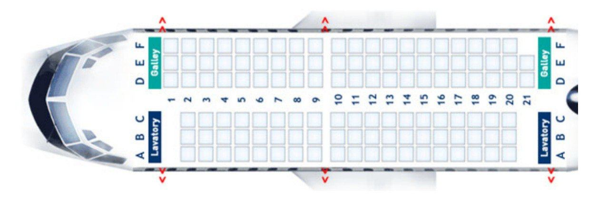

# Airplane_task

Авиакомпания А5 обновила программное обеспечение. 
Продажа билетов возможна только на первое незанятое место в самолёте. 
На рисунке представлена схема салона самолёта Boeing 737–600 с компоновкой 125E, используемой этой авиакомпанией.
Номер места в салоне является комбинацией номера ряда (число от 1 до 21) 
и номера места в ряду (одна из букв «A», «B», «C», «D», «E», «F»). 
При этом в первом ряду только три места: 1D, 1E и 1F, а в последнем ряду — два: 21D и 21E.
Первым всегда продаётся место с номером 1D, затем — место с номером 1E, третьим — 1F, четвёртым — 2A и т.д.
Напишите программу, которая по количеству проданных билетов определяет и выводит на экран 
номер первого свободного места или слово full, если все билеты проданы.

Формат входных данных
Программа получает на вход одно целое неотрицательное число n — количество проданных билетов (0≤n≤119).

Формат выходных данных
Выведите номер первого свободного места или слово full, если все билеты проданы.

Примеры
Ввод
Вывод
4
2B
100
18B

